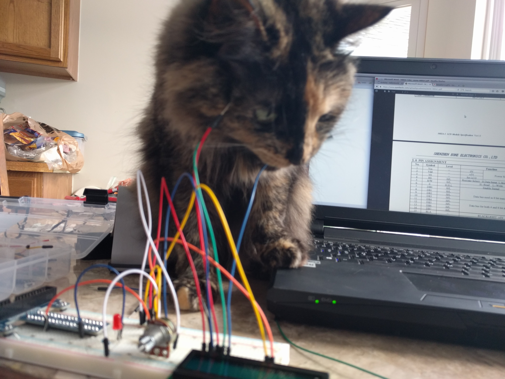

name: title
# Test Driven Development


---
name: whatistdd
class: center middle
# What Is Test Driven Development?

Code that runs quickly on your development workstation.

The fastest route to a shippable product.

How Nate and Clay make their daily bread.
---
title: redtest
class: center middle
## Write A Failing Test

It should be something you want to be true about your code.

If it doesn't fail, you did something wrong.

This state is called .red[Red]

---
title: greentest
class: center middle
## Make It Pass

Do the simplest thing possible.

Don't try to anticipate what you'll need later.  You'll miss important test cases if you do.

This state is called .green[Green]

---
title: refactor
class: center middle
## Refactor

Look for opportunities to make the code cleaner.

Only do this if all of your test are .green[green].

---
# What Does A Test Look Like?

```c
TEST(Controller, setup_byDefault_setsLastCheckedToCurrentTimer) {
  
  // Arranging Pre-Conditions
  timer_value_will_return(1, 75);

  // Execute the function we care about
  setup();

  // Test the results of the execution
  TEST_ASSERT_EQUAL(75, MOTOR_STATE.last_check);
}
```
???
This is a good example of the Arrange, Execute, Assert pattern for tests
---
name: abstractionftw
class: middle
# Abstract Away Your Actions to Hide System Calls

* Separate your program logic from the hardware control.

* Write tests of your program logic first, to capture your intent.

* We don't need to test the hardware control functions if they're just a pass-through wrapper around a system call.
???
Good example of the clean interface this provides in `src/state_transition.c`
---
name: simplifiedapplogic
# A Bit of Program Logic
```c
void state_bottom(void) {
  MOTOR_STATE.direction = UP;
  motor_down_off();
  timer_wait(1);
  motor_up_on();
  MOTOR_STATE.last_check = timer_value();
  motor_speed_set(MOTOR_SPEED);
}
```
---
name: notcallingsystemcalls
class: center middle
# How Not To Call System Calls

Sometimes we need a *test double*.

It's like a stunt double, but for your tests.

Look just like the real function, but don't actually affect hardware.

???
Look at a simple mock, such as in `mock/mock_motor.c`

---
name: usingtestdoubles
# When Do I Use a Test Double?

* When I am calling a system function I don't have on my build system.

* When I am calling a system function that I need to control the return value.

* When calling a function would introduce a dependency in my test unrelated to what I am testing.

* When I need to know the function I'm testing called another function.

---
name: arrangingmocks
# Functions for Arranging
```c
#define WILL_RETURN_MAX 20

unsigned long will_return[WILL_RETURN_MAX];
int WILL_RETURN_IDX = 0;

void timer_value_will_return(int num_values, ...) {
    va_list valist;
    int i;

    for (i = 0; i < WILL_RETURN_MAX; ++i) {
        will_return[i] = 0;
    }

    va_start(valist, num_values);
    for (i = 0; i < num_values && i < WILL_RETURN_MAX; ++i) {
        will_return[i] = va_arg(valist, unsigned long);
    }
    va_end(valist);
    WILL_RETURN_IDX = 0;
}
```
???
This function accepts a variable length list of values which will be returned by the timer_value function.

The va_start and va_arg semantics are a bit odd at first, but man pages provide examples and explain usage well enough to make this easy.
---
name: executingmocks
class: middle
# Functions for Executing

## The Actual Function
```c
unsigned long timer_value(void) { return millis(); }
```

## The Mock Function
```c
unsigned long timer_value(void) {
    mock_register_call(timer_value);
    return will_return[WILL_RETURN_IDX++];
}
```
???
mock_register_call is part of a mocking library I created for this project.  You are free to use this library for your own project, or to write a better one.
---
name: checkingmocks
# Asserting Mocks Were Called

```c
TEST(Transition, stateBottom_byDefault_setsLastCheckedAfterTimerWait) {
  timer_value_will_return(1, 57);
  state_bottom();
  TEST_ASSERT_TRUE(mock_called_inorder(2, timer_wait, timer_value));
  TEST_ASSERT_EQUAL(57, MOTOR_STATE.last_check);
}
```
???
Note the cunning use of `timer_value_will_return()`

`mock_called_inorder()` is another function from my mocking library.  It will see if the mocks listed were called in the order you listed them.
---
name: putingittogether
class: right
# Putting It All Together

Abstract each logical action to a function.

Create a mock for each logical action function.

Test program logic.

Make main test runner return non-zero if there are failed tests.

Make buildof your program(s) dependent upon successful tests
---
# My Project Makefile
```make
.PHONY: all clean mock test src package framework unity

all: src

framework:
	make -C framework

unity:
	make -C unity

mock:
	make -C mock

test: mock unity
	make -C src clean
	make -C test

src: test framework
	make -C src
```
---
name: thankyou
class: middle center
# Thank You

For more information sign up for my mailing list at `http://claydowling.com/subscribe`